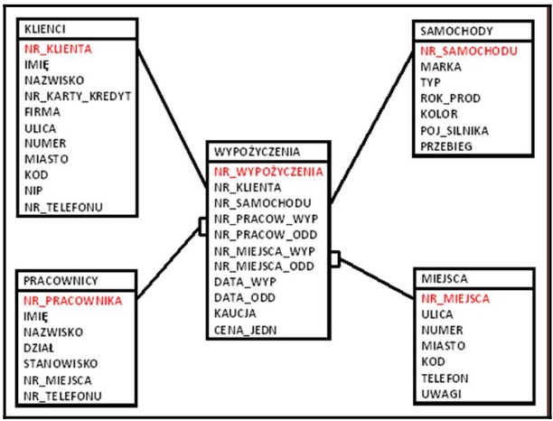

### Practicing DQL statements

This directory contains solved exercises from the laboratory section of the "Databases" course I took in my third semester. 

All queries were executed on the *wypożyczalnia_aut* (eng. car_rental_company) database, which consisted of five tables. The database stored information about clients, staff members, cars, rental locations, and individual rentals.

ERD diagram of a *wypożyczalnia_aut* database (in polish):
